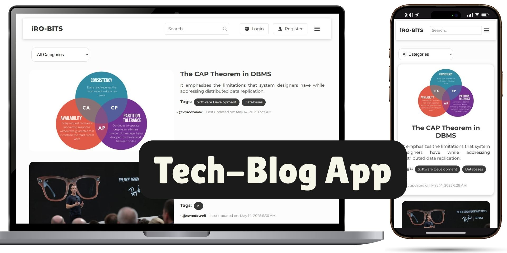

# **Tech Blog App - (AWS Lambda | AWS S3 Client | Netlify)**  

 

🚀 This is a **full-stack blog platform** built for tech enthusiasts, developers, and content creators. Created with React, Node.js, ExpressJs and MongoDB. Currently the API has been deployed on **AWS Lambda** for a cost-efficient, scalable, serverless backend. While the React App has been hosted on **Netlify**.

🔹 **Write & share** tech blogs with rich formatting  
🔹 **Manage profiles** for all authenticated users  
🔹 **Manage Posts** for new / approved / pending posts  
🔹 **Secure user sessions** with manual JWT authentication  
🔹 **Admin-dashboard** for stats / users / posts moderation  
🔹 **AWS S3 integration** for fast banner image uploads  
🔹 **Fully responsive web design** across all devices  

[](https://irobits.netlify.app)  
[](https://3h0q3y2iyd.execute-api.eu-north-1.amazonaws.com)  

## **🤔 Why This Project? (Solves 3 Real-World Problems)**  
### **1. Problem: Secure, Scalable Blogging for Tech Communities**  
   - **Point**: Many small tech communities/startups need a **lightweight, secure blog** without WordPress bloat or expensive hosting.  
   - **Solution**:  
    - ✅ **JWT + HTTP-only cookies** prevent XSS attacks (common in localStorage auth).  
    - ✅ **AWS Lambda** ensures zero server maintenance + auto-scaling for traffic spikes.  
    - ✅ **Admin moderation** lets teams collaboratively review posts before publishing.  

### **2. Problem: Content Moderation Struggles**  
   - **Point**: Solo founders or small teams waste time manually reviewing spam/low-quality posts.  
   - **Solution**:  
    - ✅ **Role-based access control (RBAC)**: Admins approve/reject posts, ban users.  
    - ✅ **AWS S3 image validation**: Blocks uploads larger than 1.5mb or type is not JPG/PNG/WEBP.  
    - ✅ **Pending posts dashboard**: Streamlines editorial workflows.  

### **3. Problem: Developer-First Publishing**  
   - **Point**: Devs hate CMS like WordPress but need Markdown/Rich text + code snippets.  
   - **Solution**:  
    - ✅ **React Quill editor**: Supports code blocks, headers, and images—native to dev workflows.  
    - ✅ **Category tagging**: Organizes posts by tech stacks (e.g., "AI", "Cybersecurity").  
    - ✅ **Real-time search**: Finds posts by keywords or tags instantly.  

## **✨ Features**  

### **🔐 Authentication & Security**  
- **JWT-based auth** with HTTP-only cookies (SameSite + Secure)
- **Bcrypt** password hashing to encrypt user accounts in the database
- **env** to store private project keys
- **Role-based**  access control - (User, Admin)  
- **CORS** configured for multiple origins (Localhost + Netlify)  

### **📝 Blog Management**  
- Only **authenticated Users & Admins** are allowed to create posts   
- Features **Rich text editor** for blog post content creation (React Quill)   
- All **Banner image** of new posts uploaded to AWS S3 Bucket (1.5MB max, JPG/PNG/WEBP only)  
- Select upto 3 **Category** tags (max) per post  
- **My posts** will show list of all posts by a user  
- **User posts** are only published for public view after approval  
- Only **Admin** can Approve/Reject posts
- Only **Post Author & Admin** can edit posts

### **👤 User Profile**  
- **New Users** can **register** with - Name, Email, Username & Password
- **Users** can **login** with - Username & Password
- All **User information** can be accessed in the **My profile** page 
- **Users** can only edit first/last name & password  
- **Email & Username** are unique & cannot be changed

### **🌎 Site Navigation**  
- **React Router** used to manage web page navigations
- **Header Navbar** used to navigate to different sections/pages
- **Menu button** 
  - *Logged In* -> My profile, Contact Us & Log out options  
  - *Not Logged In* -> Login, Register & Contact Us options  
- **Home page, Login, Register, Contact** are publically accessible by all
- **Home page** displays 3 most recent posts
- The other posts in **Home page** are paginated
- Each post is linked to its **Post Page** to view
- **Loading screen** is shown until posts are fetched (React Spinner)
- **Back button** visible on all pages to go back to previous webpage
- **Go-Up button** visible once scrolled down on Home or Post page
- **Contact page** uses EmailJS & React Hook form for submissions
- **Footer** is visible at bottom with basic site information

### **🔍 Search & Filter**  
- **Real-time search** using post title, summary, content, username
- **Blog posts** can be filtered with categories filter option (12 available)

### **🛠 Admin Dashboard**  
- Shows **Stat Cards** on Total users, posts & pending approvals 
- **Pending Posts Management**: View, Edit, Approve & Delete posts
- **User Management**: View, Edit information, Make Admin & Delete users 
- **Approved Posts Management**: View, Edit, Delete posts

### **🎨 Responsive Design**  
- UI designed on **Mobile-first** approach  
- Styled only using **Vanilla CSS** (Lightweight & No frameworks used)  
- Responsive webdesign for various screen sizes (desktop, tablet, mobile)


## **🛠 Tech Stack**  

### **Frontend**  
- **React.js(Vite)** - Fast React framework with optimized builds  
- **Context API**    - Global state management for user/auth data  
- **Fetch API**      - HTTP requests to backend API
- **Vanilla CSS**    - Custom styling with CSS variables  

### **Backend**  
- **Node.js**        - JavaScript runtime for server-side logic 
- **Express**        - Web framework for API routes  
- **MongoDB Atlas**  - Cloud-hosted NoSQL database  
- **AWS Lambda**     - Serverless execution for API endpoints  
- **AWS S3**         - Cloud storage for post images  

### **Key Packages Used**  
| Frontend           |      UseCase                       |  
|--------------------|------------------------------------|  
| `@emailjs/browser` |Send contact form emails            |  
| `date-fns`         |Format dates/times in UI            |   
| `react-hook-form`  |Form validation/handling            |   
| `react-icons`      |SVG icons for UI                    |  
| `react-router-dom` |Client-side routing                 |  
| `react-quill`      |Rich text editor for blog posts     |  
| `react-spinner`    |Loading animations during data fetch|  


| Backend                |      UseCase                              |  
|------------------------|-------------------------------------------|  
| `@aws-sdk/client-s3`   |Upload/delete images from AWS S3           |  
| `@aws-sdk/lib-storage` |Stream large files to S3                   |   
| `bcryptjs`             |Hash passwords securely                    |   
| `cookie-parser`        |Parse HTTP cookies for JWT tokens          |  
| `cors`                 |Enable cross-origin API requests           |  
| `dotenv`               |Load environment variables                 |  
| `express`              |Handle API routes/middleware               |  
| `jsonwebtoken`         |Generate/verify auth tokens                |  
| `mongoose`             |Model data and query MongoDB               |  
| `multer`               |Process multipart/form-data (file uploads) |  
| `nodemon`              |Auto-restart server during development     |  
| `swagger-jsdoc`        |Scans route files to generate OpenAPI specs|  
| `swagger-ui-express`   |Serves the interactive docs interface      |  

## **🚀 Deployment**  

### **Frontend**  
- Hosted on **Netlify**: 🔗 **[Client App](https://irobits.netlify.app)**  

### **Backend**  
- **AWS Lambda** (Serverless)  
- **API Gateway** - 🔗 **[Web API](https://3h0q3y2iyd.execute-api.eu-north-1.amazonaws.com)**  
- **MongoDB Atlas** (Cloud Database)  
- **AWS S3** (Post banner images)  


## **⚙️ Setup & Run Locally**  

### **Prerequisites**  
- Node.js (v18+)  
- MongoDB Atlas URI  
- AWS S3 Bucket Credentials  

### **1. Clone the Repository**  
```bash
git clone https://github.com/ckiroshan/mern-tech-blog.git
cd mern-tech-blog
```

### **2. Install Dependencies**  
```bash
# Frontend
npm install

# Backend
cd ../api
npm install
```

### **3. Configure Environment Variables**  
**Frontend (`.env`)**  
```env
VITE_API_URL=http://localhost:8021  # or your Lambda endpoint
```

**Backend (`api/.env`)**  
```env
ATLAS_URI=mongodb+srv://...
AWS_ACCESS_KEY=...
AWS_SECRET_KEY=...
AWS_REGION=eu-south-1
AWS_S3_BUCKET=your-bucket-name
JWT_SECRET=your-secret-key
```

### **4. Run the App**  
```bash
# Frontend (http://localhost:5173)
npm run dev

# Backend (http://localhost:8021)
cd ../api
npm start
```


## **📄 API Documentation**  
This project uses **Swagger UI** for interactive API documentation, automatically generated from JSDoc comments in the backend code. It provides:  

- **Live testing** of all endpoints directly in the browser  
- **Detailed schemas** for requests/responses  
- **Authentication** support (try JWT-token requests)  
- **Code samples** in JavaScript  

🔗 **[Swagger UI Link](https://3h0q3y2iyd.execute-api.eu-north-1.amazonaws.com/api-docs)**  

| Endpoint          | Description           | Auth Required       |  
|-------------------|-----------------------|---------------------|  
| `/api/auth/*`     | User authentication   | NO  (Public)        |  
| `/api/posts`      | Blog post CRUD        | YES (JWT)           |  
| `/api/admin/*`    | Admin actions         | YES (JWT + Admin)   |  


## **📸 Screenshots**  

|             |  |  
|:----------------------------------------------------:|:----------------------------------------------------------:|  
| *Homepage (Latest Posts)*                            | *Admin Dashboard*                                          |  

|     |          |  
|:----------------------------------------------------:|:----------------------------------------------------------:| 
| *My Profile (User information & User posts)*         | *Create Post Editor (Input fields + React Quill Editor)*   | 

|   |    |    | 
|:----------------------------------------------------:|:----------------------------------------------------------:| :----------------------------------------------------------:|
| *Homepage (Mobile view)*                             | *My Profile (Mobile view)*                                 | *Create Post (Mobile view)* |  


## **📜 Contribution**  
Contributions are closed at this moment.  


## **💡 Future Improvements**  
- [ ] **Comments & Reactions** on posts  
- [ ] **Email notifications** for post approvals  
- [ ] **Dark mode** toggle  
- [ ] **Server Side Rendering (SSR)** for better SEO  